# Yoni's Rec League

Welcome to Yoni's Rec League. Whether you want to own and manage a team, play some basketball, or both, this is the perfect place for you. We have an ever-growing community and will be happy to have more. Make sure to sign up before the season starts!
  

## Getting Started:
#### Check out the league here: [https://yoni-rec-league.herokuapp.com/](https://yoni-rec-league.herokuapp.com/)
#### Check out the trello board here: [https://trello.com/b/6MwbPj1U/unit-2-project](https://trello.com/b/6MwbPj1U/unit-2-project)

  
## Screenshots:
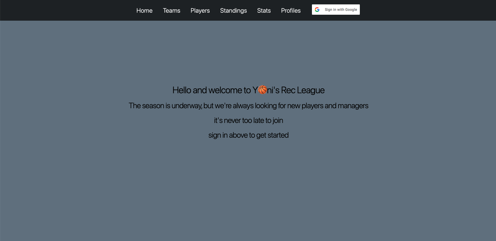
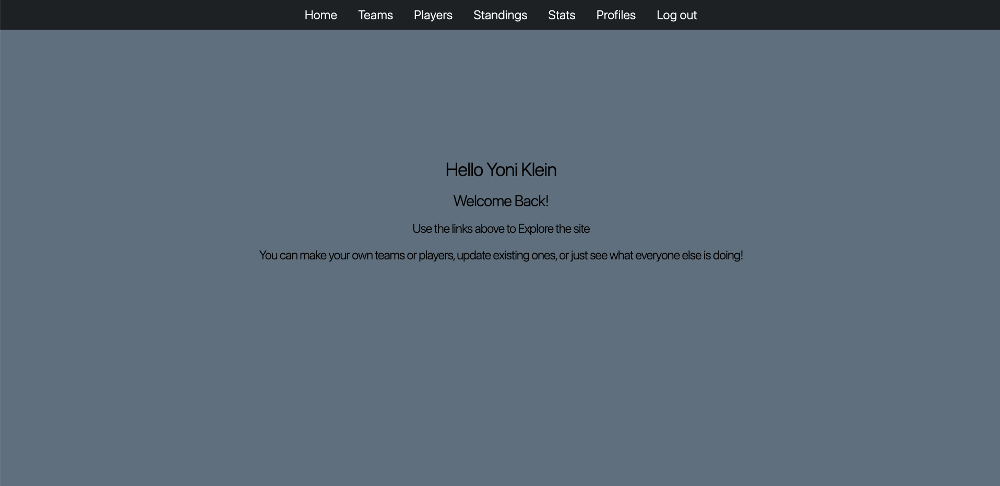
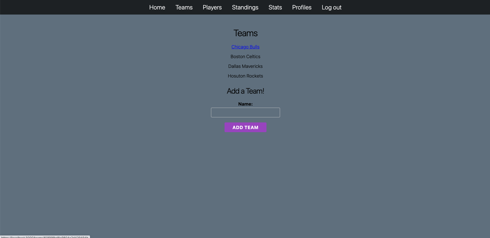
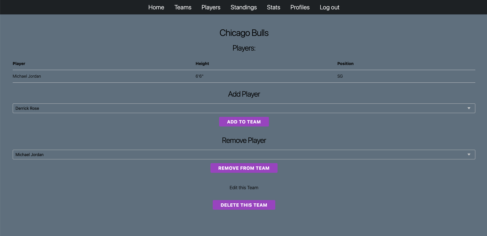
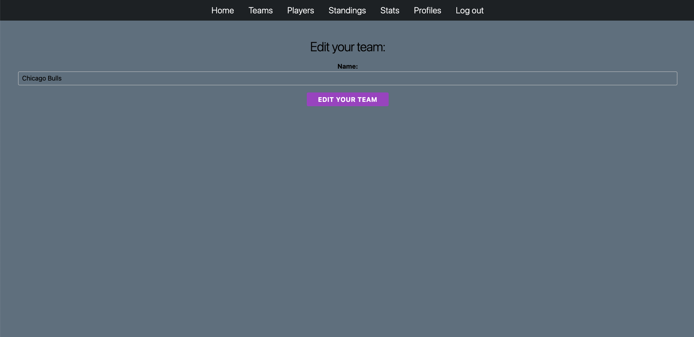
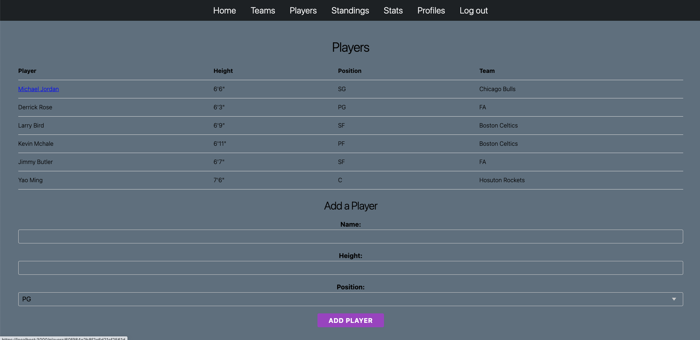
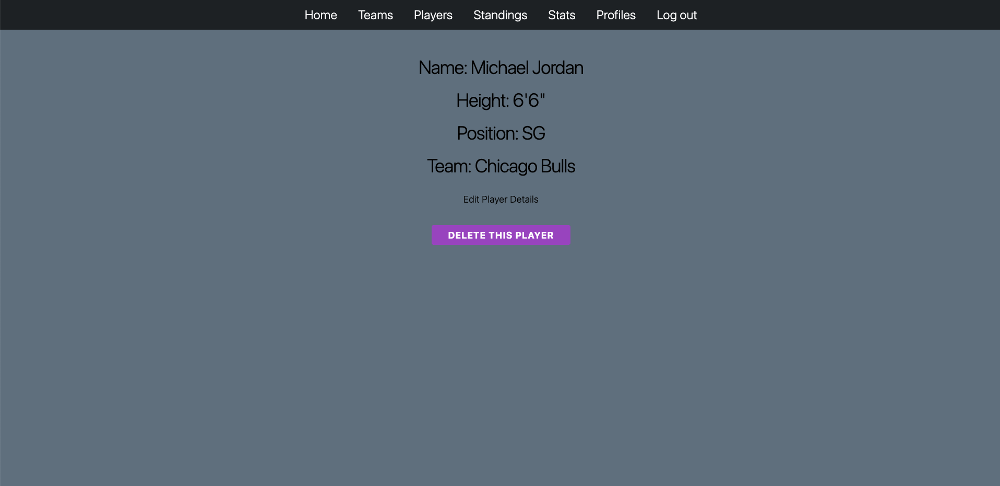
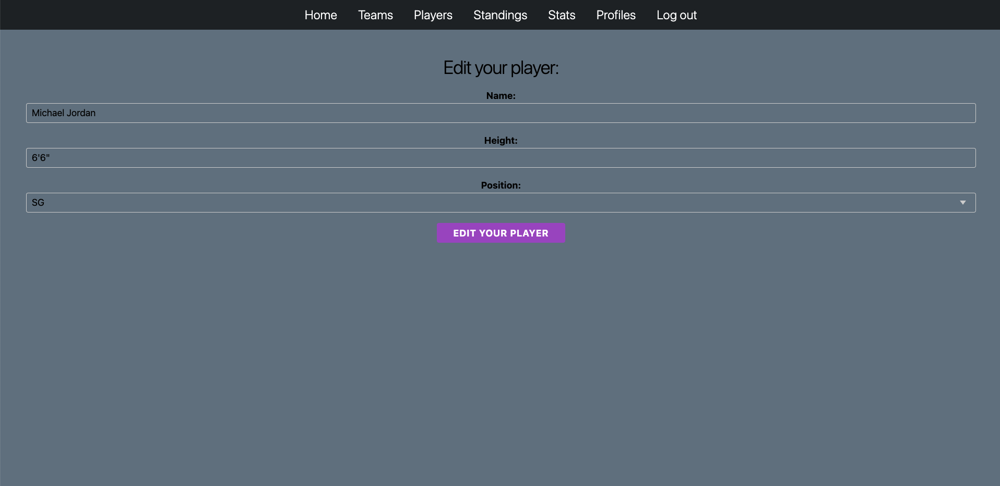
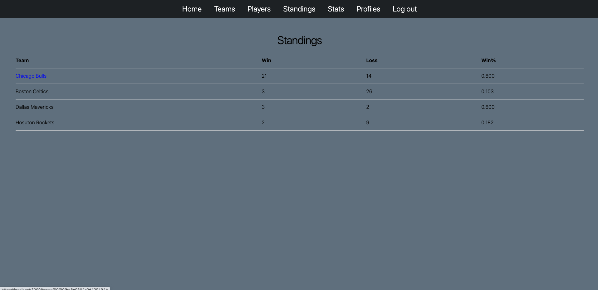
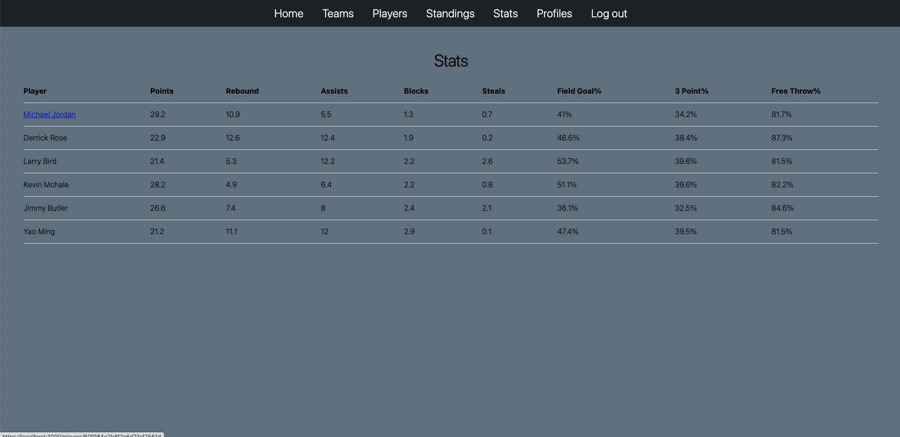
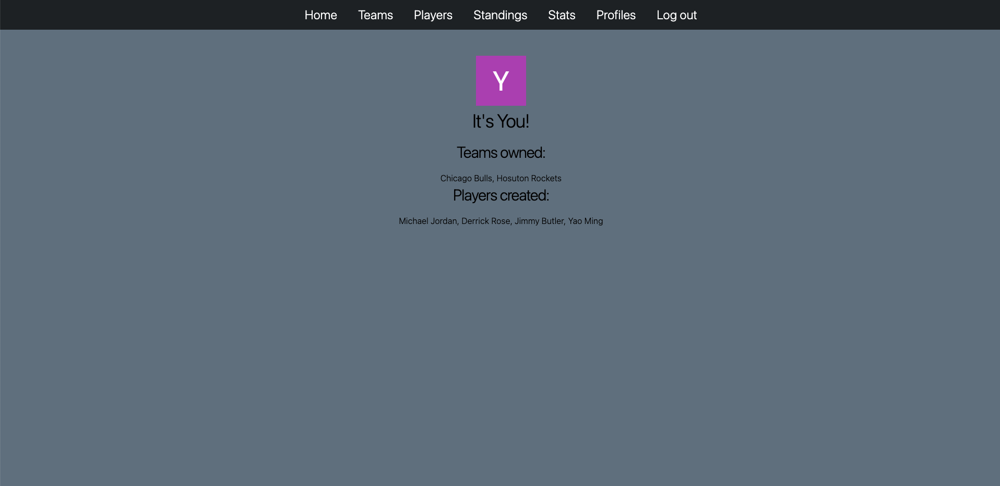

  
## Technologies used: 
* Javascript
* HTML
* CSS
* Markup
* EJS
* Node
* Express
* Mongoose
* Git
  
## Next steps: 
* An embedded chat feature
* More player control
* more details